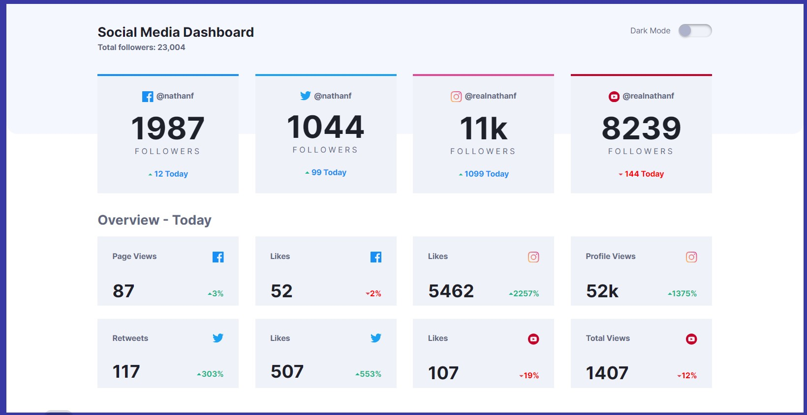

# Frontend Mentor - Social media dashboard with theme switcher solution

This is a solution to the [Social media dashboard with theme switcher challenge on Frontend Mentor](https://www.frontendmentor.io/challenges/social-media-dashboard-with-theme-switcher-6oY8ozp_H). Frontend Mentor challenges help you improve your coding skills by building realistic projects.

## Table of contents

- [Overview](#overview)
  - [The challenge](#the-challenge)
  - [Screenshot](#screenshot)
  - [Links](#links)
- [My process](#my-process)
  - [Built with](#built-with)
  - [What I learned](#what-i-learned)
  - [Continued development](#continued-development)
  - [Useful resources](#useful-resources)
- [Author](#author)
- [Acknowledgments](#acknowledgments)

## Overview

### The challenge

Users should be able to:

- View the optimal layout for the site depending on their device's screen size
- See hover states for all interactive elements on the page
- Toggle color theme to their preference

### Screenshot



### Links

- Solution URL: Pending
- Live Site URL: Pending

## My process

### Built with

- Semantic HTML5 markup
- CSS custom properties
- Flexbox
- CSS Grid
- Mobile-first workflow

### What I learned

Another practice on switch theme, light to dark, setting up a button with a hidden checkbox.

Html markup

```html
<div class="mode-toggler">
  <p>Dark Mode</p>
  <div class="button-box">
    <input type="checkbox" id="darkmode-toggle" />
    <label for="darkmode-toggle"></label>
  </div>
</div>
```


Toggle button, animated, with css only.
```css
/* *** Toggle theme button from here ***  */
header .mode-toggler {
  width: 100%;
  display: flex;
  justify-content: space-between;
  align-items: center; 
}

header .mode-toggler p {
  color: var(--text-2);
}

header .mode-toggler .button-box {
  display: flex;
  align-items: center;
  justify-content: flex-end; 
}

label {
  width: 60px; /* 500 */
  height: 24px; /* 200 */
  position: relative;
  display: block;
  background: var(--card-bg);  
  border-radius: 24px; /* 200 */
  box-shadow: inset 0px 2px 5px rgba(0, 0, 0, 0.4),
    inset 0px -2px 5px rgba(255, 255, 255, 0.4);
  cursor: pointer;
  transition: 0.3s;
}

label:after {
    content: "";
    width: 21px; /* 180 */
    height: 21px; /* 180 */
    position: absolute;
    top: 1.5px; /* 10 */
    left: 1.2px; /* 10 */
    background: hsl(230, 22%, 74%);   
    border-radius: 21px; /* 180 */
    box-shadow: 0px 2px 4px rgba(0, 0, 0, 0.2); /* 0 5 10 */
    transition: 0.3s;
}

input {
  width: 0;
  height: 0;
  visibility: hidden;
}

input:checked + label { 
  background: linear-gradient( hsl(210, 78%, 56%), hsl(146, 68%, 55%));
}

input:checked + label:after {
  left: 60px; /* 490 */
  transform: translateX(-100%);
  background: linear-gradient(180deg, #777, #3a3a3a);
}

label:active::after {
  width: 31px; /* 260 */
}

/* Toggle theme button down to here */
```


### Continued development


Continue improving my coding skills by developing challenging applications, like this one.

### Useful resources

- [Toggle button example, video](https://www.youtube.com/watch?v=S-T9XoCMwt4&t=11s) - Provided me the example of animated toggle button.


## Author

- Website - [Guillermo Dominguez](https://gdominguez-portfolio.netlify.app)
- Frontend Mentor - [@memominguez](https://www.frontendmentor.io/profile/memominguez)


## Acknowledgments


Thanks to all those who share their knowledge, free of charge, through video tutorials in the youtube platform.
 
